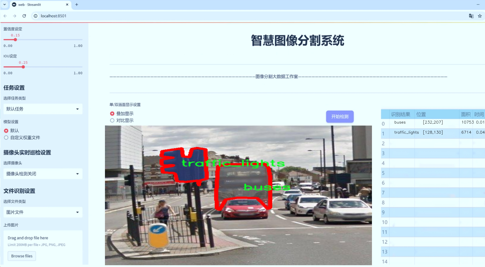

# 城市交通场景分割系统源码＆数据集分享
 [yolov8-seg-FocalModulation＆yolov8-seg-C2f-Faster-EMA等50+全套改进创新点发刊_一键训练教程_Web前端展示]

### 1.研究背景与意义

项目参考[ILSVRC ImageNet Large Scale Visual Recognition Challenge](https://gitee.com/YOLOv8_YOLOv11_Segmentation_Studio/projects)

项目来源[AAAI Global Al lnnovation Contest](https://kdocs.cn/l/cszuIiCKVNis)

研究背景与意义

随着城市化进程的加快，城市交通管理面临着前所未有的挑战。交通拥堵、事故频发以及环境污染等问题日益严重，亟需通过智能化手段进行有效管理。近年来，计算机视觉技术的快速发展为城市交通场景的分析与管理提供了新的解决方案。其中，目标检测与分割技术作为计算机视觉的重要研究方向，已被广泛应用于自动驾驶、智能交通监控等领域。YOLO（You Only Look Once）系列模型因其高效的实时检测能力而受到广泛关注，尤其是YOLOv8的推出，使得目标检测的精度和速度得到了进一步提升。

本研究旨在基于改进的YOLOv8模型，构建一个针对城市交通场景的分割系统。该系统将利用一个包含1000张图像的实例分割数据集，数据集中涵盖了10个类别，包括自行车、公交车、烟囱、人行横道、消防栓、摩托车、楼梯、出租车、拖拉机和交通信号灯等。这些类别的选择不仅反映了城市交通的多样性，也为研究提供了丰富的实例分割任务。通过对这些交通元素的精准识别与分割，能够为城市交通管理提供更加细致和准确的数据支持。

在当前的研究背景下，传统的交通监控方法往往依赖于人工观察和简单的图像处理技术，效率低下且易受环境因素影响。相较之下，基于深度学习的图像分割技术能够自动提取图像特征，实现高效、准确的目标识别与分割。通过对交通场景中各类目标的实时检测与分割，能够为交通流量分析、事故预警、城市规划等提供重要的数据基础。此外，改进YOLOv8模型的应用，旨在提升在复杂城市环境下的检测精度，克服传统模型在多目标重叠、遮挡及光照变化等问题上的不足。

本研究的意义不仅在于技术层面的创新，更在于其对城市交通管理的实际应用价值。通过构建高效的城市交通场景分割系统，可以为交通管理部门提供实时监控和数据分析的能力，帮助其更好地进行交通流量调控、事故响应和资源配置。同时，该系统的实现也将为未来的智能交通系统奠定基础，推动自动驾驶技术的发展与应用。

综上所述，基于改进YOLOv8的城市交通场景分割系统的研究，不仅具有重要的学术价值，也为城市交通管理提供了切实可行的解决方案。通过对交通场景的深入分析与理解，能够有效提升城市交通的安全性与效率，为建设智慧城市贡献力量。

### 2.图片演示





##### 注意：由于此博客编辑较早，上面“2.图片演示”和“3.视频演示”展示的系统图片或者视频可能为老版本，新版本在老版本的基础上升级如下：（实际效果以升级的新版本为准）

  （1）适配了YOLOV8的“目标检测”模型和“实例分割”模型，通过加载相应的权重（.pt）文件即可自适应加载模型。

  （2）支持“图片识别”、“视频识别”、“摄像头实时识别”三种识别模式。

  （3）支持“图片识别”、“视频识别”、“摄像头实时识别”三种识别结果保存导出，解决手动导出（容易卡顿出现爆内存）存在的问题，识别完自动保存结果并导出到tempDir中。

  （4）支持Web前端系统中的标题、背景图等自定义修改，后面提供修改教程。

  另外本项目提供训练的数据集和训练教程,暂不提供权重文件（best.pt）,需要您按照教程进行训练后实现图片演示和Web前端界面演示的效果。

### 3.视频演示

[3.1 视频演示](https://www.bilibili.com/video/BV1cVSEYDE6e/)

### 4.数据集信息展示

##### 4.1 本项目数据集详细数据（类别数＆类别名）

nc: 10
names: ['bicycles', 'buses', 'chimneys', 'crosswalks', 'fire_hydrants', 'motorcycles', 'stairs', 'taxis', 'tractors', 'traffic_lights']


##### 4.2 本项目数据集信息介绍

数据集信息展示

在城市交通场景分割的研究中，数据集的选择至关重要。本项目所采用的数据集名为“google-rectapcha-image-seg-0205”，它为训练和改进YOLOv8-seg模型提供了丰富的图像数据和标注信息。该数据集包含10个类别，涵盖了城市交通环境中常见的物体，这些类别分别是：自行车（bicycles）、公交车（buses）、烟囱（chimneys）、人行横道（crosswalks）、消防栓（fire_hydrants）、摩托车（motorcycles）、楼梯（stairs）、出租车（taxis）、拖拉机（tractors）和交通信号灯（traffic_lights）。这些类别的选择不仅反映了城市交通的多样性，也为模型的训练提供了良好的基础。

在进行城市交通场景分割时，YOLOv8-seg模型需要准确识别和分割出不同类别的物体，以便实现高效的交通管理和安全监控。数据集中的每个类别都代表了城市交通中不可或缺的元素。例如，自行车和摩托车作为重要的交通工具，具有不同的运动特性和空间占用，模型需要能够有效区分它们，以便在实际应用中进行更为精准的交通流量分析。公交车和出租车则是公共交通的重要组成部分，其识别和分割不仅有助于交通调度，还能为城市规划提供数据支持。

此外，烟囱、消防栓和楼梯等物体虽然在交通场景中不直接参与交通流动，但它们的存在与城市基础设施的安全性和可达性密切相关。通过对这些物体的分割，模型能够更全面地理解城市环境，进而提升交通管理系统的智能化水平。人行横道和交通信号灯则是交通安全的重要保障，准确识别这些元素对于减少交通事故、提升行人安全至关重要。

数据集“google-rectapcha-image-seg-0205”不仅在类别数量上提供了多样性，还在图像质量和标注精度上达到了较高的标准。这为YOLOv8-seg模型的训练提供了良好的数据基础，使其能够在复杂的城市交通场景中进行有效的物体检测和分割。通过对该数据集的深入分析和应用，研究团队能够不断优化模型的性能，提高其在实际应用中的可靠性和准确性。

在未来的研究中，结合“google-rectapcha-image-seg-0205”数据集的丰富信息，团队将探索更多的算法改进和模型优化策略，以应对城市交通场景中日益复杂的挑战。通过持续的实验和验证，期望能够推动城市交通智能化的发展，为构建安全、高效的城市交通系统贡献力量。


### 5.全套项目环境部署视频教程（零基础手把手教学）

[5.1 环境部署教程链接（零基础手把手教学）](https://www.bilibili.com/video/BV1jG4Ve4E9t/?vd_source=bc9aec86d164b67a7004b996143742dc)


[5.2 安装Python虚拟环境创建和依赖库安装视频教程链接（零基础手把手教学）](https://www.bilibili.com/video/BV1nA4VeYEze/?vd_source=bc9aec86d164b67a7004b996143742dc)

### 6.手把手YOLOV8-seg训练视频教程（零基础小白有手就能学会）

[6.1 手把手YOLOV8-seg训练视频教程（零基础小白有手就能学会）](https://www.bilibili.com/video/BV1cA4VeYETe/?vd_source=bc9aec86d164b67a7004b996143742dc)


按照上面的训练视频教程链接加载项目提供的数据集，运行train.py即可开始训练



     Epoch   gpu_mem       box       obj       cls    labels  img_size
     1/200     0G   0.01576   0.01955  0.007536        22      1280: 100%|██████████| 849/849 [14:42<00:00,  1.04s/it]
               Class     Images     Labels          P          R     mAP@.5 mAP@.5:.95: 100%|██████████| 213/213 [01:14<00:00,  2.87it/s]
                 all       3395      17314      0.994      0.957      0.0957      0.0843

     Epoch   gpu_mem       box       obj       cls    labels  img_size
     2/200     0G   0.01578   0.01923  0.007006        22      1280: 100%|██████████| 849/849 [14:44<00:00,  1.04s/it]
               Class     Images     Labels          P          R     mAP@.5 mAP@.5:.95: 100%|██████████| 213/213 [01:12<00:00,  2.95it/s]
                 all       3395      17314      0.996      0.956      0.0957      0.0845

     Epoch   gpu_mem       box       obj       cls    labels  img_size
     3/200     0G   0.01561    0.0191  0.006895        27      1280: 100%|██████████| 849/849 [10:56<00:00,  1.29it/s]
               Class     Images     Labels          P          R     mAP@.5 mAP@.5:.95: 100%|███████   | 187/213 [00:52<00:00,  4.04it/s]
                 all       3395      17314      0.996      0.957      0.0957      0.0845


### 7.50+种全套YOLOV8-seg创新点代码加载调参视频教程（一键加载写好的改进模型的配置文件）

[7.1 50+种全套YOLOV8-seg创新点代码加载调参视频教程（一键加载写好的改进模型的配置文件）](https://www.bilibili.com/video/BV1Hw4VePEXv/?vd_source=bc9aec86d164b67a7004b996143742dc)

### 8.YOLOV8-seg图像分割算法原理

原始YOLOv8-seg算法原理

YOLOv8-seg算法是YOLO系列目标检测算法的最新迭代，建立在YOLOv5和YOLOv7的基础上，结合了前者的优点并引入了一系列创新性改进。该算法的核心结构包括输入层、主干网络、特征融合层和解耦头，旨在实现高效的目标检测和分割任务。尽管YOLOv8的相关论文尚未正式发表，但其在设计理念和实现细节上已显示出强大的潜力。

首先，YOLOv8的主干网络依然采用了YOLOv5的CSPDarknet结构，但进行了关键性的改进。具体而言，YOLOv8将YOLOv5中的C3模块替换为C2f模块，这一变化不仅实现了模型的轻量化，还在保持检测精度的同时增强了特征提取的能力。C2f模块的设计灵感来源于YOLOv7的ELAN思想，具备更丰富的梯度流动信息，从而有效缓解了深层网络中的梯度消失问题。C2f模块通过引入多个分支和Bottleneck结构，使得特征图在经过卷积和归一化处理后，能够更好地捕捉到目标的细节信息。

在特征融合方面，YOLOv8采用了PAN-FPN结构，进一步增强了多尺度特征的融合能力。通过自下而上的特征融合，YOLOv8能够有效地结合浅层特征和高层特征，确保在目标检测过程中，既能保留细节信息，又能获得全局语义信息。这种特征融合策略使得YOLOv8在处理不同尺度的目标时表现出色，能够更准确地识别和定位目标。

值得注意的是，YOLOv8引入了Anchor-Free的思想，摒弃了传统的Anchor-Base方法。这一转变使得模型在处理目标时更加灵活，能够适应不同形状和大小的目标。此外，YOLOv8采用了Task-Aligned的样本匹配策略，相较于以往的静态匹配方法，能够更好地适应不同任务的需求，提高了模型的整体性能。

在损失函数的设计上，YOLOv8使用了VFLLoss作为分类损失，并结合DFLLoss和CIoULoss进行回归损失的计算。这种多损失函数的组合策略，有助于提升模型在分类和定位任务上的表现，确保在训练过程中能够更好地优化模型参数。

YOLOv8的输入层负责对图像进行预处理，包括调整图像比例和实现数据增强。具体的增强手段包括马赛克增强、混合增强、空间扰动和颜色扰动等，这些技术的引入有效地提高了模型的鲁棒性和泛化能力。在数据预处理完成后，图像被送入到CBS网络中进行特征提取。CBS结构结合了卷积、归一化和SiLU激活函数，通过卷积层提取目标的纹理和颜色信息，同时利用归一化技术解决反向传播过程中的梯度消失和梯度爆炸问题。

YOLOv8的Head部分采用了解耦头结构，将分类和回归分支进行分离，这一设计理念借鉴了YOLOX和YOLOv6的成功经验。解耦头的使用加速了模型的收敛过程，使得YOLOv8在处理复杂场景时能够更快地适应并做出准确的预测。具体而言，YOLOv8的Head部分输出三个不同尺度的特征图，分别为80x80、40x40和20x20，确保模型在多尺度目标检测中的高效性。

在训练过程中，YOLOv8采用了Focal Loss作为分类损失函数，旨在解决样本不平衡的问题。通过调整损失函数中的平衡参数和聚焦参数，YOLOv8能够有效地提高对难以分类样本的关注度，从而提升模型的整体检测精度。

总的来说，YOLOv8-seg算法在YOLO系列的基础上进行了多方面的创新和改进，特别是在特征提取、特征融合和损失函数设计等方面的优化，使得该算法在目标检测和分割任务中表现出色。通过结合先进的网络结构和有效的训练策略，YOLOv8-seg不仅提升了检测精度，还提高了模型的计算效率，为实际应用提供了更为强大的技术支持。随着YOLOv8的不断发展和完善，未来有望在更广泛的领域中发挥重要作用。


### 9.系统功能展示（检测对象为举例，实际内容以本项目数据集为准）

图9.1.系统支持检测结果表格显示

  图9.2.系统支持置信度和IOU阈值手动调节

  图9.3.系统支持自定义加载权重文件best.pt(需要你通过步骤5中训练获得)

  图9.4.系统支持摄像头实时识别

  图9.5.系统支持图片识别

  图9.6.系统支持视频识别

  图9.7.系统支持识别结果文件自动保存

  图9.8.系统支持Excel导出检测结果数据


### 10.50+种全套YOLOV8-seg创新点原理讲解（非科班也可以轻松写刊发刊，V11版本正在科研待更新）

#### 10.1 由于篇幅限制，每个创新点的具体原理讲解就不一一展开，具体见下列网址中的创新点对应子项目的技术原理博客网址【Blog】：


[10.1 50+种全套YOLOV8-seg创新点原理讲解链接](https://gitee.com/qunmasj/good)

#### 10.2 部分改进模块原理讲解(完整的改进原理见上图和技术博客链接)【如果此小节的图加载失败可以通过CSDN或者Github搜索该博客的标题访问原始博客，原始博客图片显示正常】

### YOLOv8简介
#### Backbone
Darknet-53
53指的是“52层卷积”+output layer。

借鉴了其他算法的这些设计思想

借鉴了VGG的思想，使用了较多的3×3卷积，在每一次池化操作后，将通道数翻倍；

借鉴了network in network的思想，使用全局平均池化（global average pooling）做预测，并把1×1的卷积核置于3×3的卷积核之间，用来压缩特征；（我没找到这一步体现在哪里）


使用了批归一化层稳定模型训练，加速收敛，并且起到正则化作用。

    以上三点为Darknet19借鉴其他模型的点。Darknet53当然是在继承了Darknet19的这些优点的基础上再新增了下面这些优点的。因此列在了这里

借鉴了ResNet的思想，在网络中大量使用了残差连接，因此网络结构可以设计的很深，并且缓解了训练中梯度消失的问题，使得模型更容易收敛。

使用步长为2的卷积层代替池化层实现降采样。（这一点在经典的Darknet-53上是很明显的，output的长和宽从256降到128，再降低到64，一路降低到8，应该是通过步长为2的卷积层实现的；在YOLOv8的卷积层中也有体现，比如图中我标出的这些位置）

#### 特征融合

模型架构图如下

  Darknet-53的特点可以这样概括：（Conv卷积模块+Residual Block残差块）串行叠加4次

  Conv卷积层+Residual Block残差网络就被称为一个stage


上面红色指出的那个，原始的Darknet-53里面有一层 卷积，在YOLOv8里面，把一层卷积移除了

为什么移除呢？

        原始Darknet-53模型中间加的这个卷积层做了什么？滤波器（卷积核）的个数从 上一个卷积层的512个，先增加到1024个卷积核，然后下一层卷积的卷积核的个数又降低到512个

        移除掉这一层以后，少了1024个卷积核，就可以少做1024次卷积运算，同时也少了1024个3×3的卷积核的参数，也就是少了9×1024个参数需要拟合。这样可以大大减少了模型的参数，（相当于做了轻量化吧）

        移除掉这个卷积层，可能是因为作者发现移除掉这个卷积层以后，模型的score有所提升，所以才移除掉的。为什么移除掉以后，分数有所提高呢？可能是因为多了这些参数就容易，参数过多导致模型在训练集删过拟合，但是在测试集上表现很差，最终模型的分数比较低。你移除掉这个卷积层以后，参数减少了，过拟合现象不那么严重了，泛化能力增强了。当然这个是，拿着你做实验的结论，反过来再找补，再去强行解释这种现象的合理性。


通过MMdetection官方绘制册这个图我们可以看到，进来的这张图片经过一个“Feature Pyramid Network(简称FPN)”，然后最后的P3、P4、P5传递给下一层的Neck和Head去做识别任务。 PAN（Path Aggregation Network）


“FPN是自顶向下，将高层的强语义特征传递下来。PAN就是在FPN的后面添加一个自底向上的金字塔，对FPN补充，将低层的强定位特征传递上去，

FPN是自顶（小尺寸，卷积次数多得到的结果，语义信息丰富）向下（大尺寸，卷积次数少得到的结果），将高层的强语义特征传递下来，对整个金字塔进行增强，不过只增强了语义信息，对定位信息没有传递。PAN就是针对这一点，在FPN的后面添加一个自底（卷积次数少，大尺寸）向上（卷积次数多，小尺寸，语义信息丰富）的金字塔，对FPN补充，将低层的强定位特征传递上去，又被称之为“双塔战术”。

FPN层自顶向下传达强语义特征，而特征金字塔则自底向上传达强定位特征，两两联手，从不同的主干层对不同的检测层进行参数聚合,这样的操作确实很皮。
#### 自底向上增强


而 PAN（Path Aggregation Network）是对 FPN 的一种改进，它的设计理念是在 FPN 后面添加一个自底向上的金字塔。PAN 引入了路径聚合的方式，通过将浅层特征图（低分辨率但语义信息较弱）和深层特征图（高分辨率但语义信息丰富）进行聚合，并沿着特定的路径传递特征信息，将低层的强定位特征传递上去。这样的操作能够进一步增强多尺度特征的表达能力，使得 PAN 在目标检测任务中表现更加优秀。


### Gold-YOLO简介
YOLO系列模型面世至今已有8年，由于其优异的性能，已成为目标检测领域的标杆。在系列模型经过十多个不同版本的改进发展逐渐稳定完善的今天，研究人员更多关注于单个计算模块内结构的精细调整，或是head部分和训练方法上的改进。但这并不意味着现有模式已是最优解。

当前YOLO系列模型通常采用类FPN方法进行信息融合，而这一结构在融合跨层信息时存在信息损失的问题。针对这一问题，我们提出了全新的信息聚集-分发（Gather-and-Distribute Mechanism）GD机制，通过在全局视野上对不同层级的特征进行统一的聚集融合并分发注入到不同层级中，构建更加充分高效的信息交互融合机制，并基于GD机制构建了Gold-YOLO。在COCO数据集中，我们的Gold-YOLO超越了现有的YOLO系列，实现了精度-速度曲线上的SOTA。


精度和速度曲线（TensorRT7）


精度和速度曲线（TensorRT8）
传统YOLO的问题
在检测模型中，通常先经过backbone提取得到一系列不同层级的特征，FPN利用了backbone的这一特点，构建了相应的融合结构：不层级的特征包含着不同大小物体的位置信息，虽然这些特征包含的信息不同，但这些特征在相互融合后能够互相弥补彼此缺失的信息，增强每一层级信息的丰富程度，提升网络性能。

原始的FPN结构由于其层层递进的信息融合模式，使得相邻层的信息能够充分融合，但也导致了跨层信息融合存在问题：当跨层的信息进行交互融合时，由于没有直连的交互通路，只能依靠中间层充当“中介”进行融合，导致了一定的信息损失。之前的许多工作中都关注到了这一问题，而解决方案通常是通过添加shortcut增加更多的路径，以增强信息流动。

然而传统的FPN结构即便改进后，由于网络中路径过多，且交互方式不直接，基于FPN思想的信息融合结构仍然存在跨层信息交互困难和信息损失的问题。

#### Gold-YOLO：全新的信息融合交互机制


#### Gold-YOLO架构
参考该博客提出的一种全新的信息交互融合机制：信息聚集-分发机制(Gather-and-Distribute Mechanism)。该机制通过在全局上融合不同层次的特征得到全局信息，并将全局信息注入到不同层级的特征中，实现了高效的信息交互和融合。在不显著增加延迟的情况下GD机制显著增强了Neck部分的信息融合能力，提高了模型对不同大小物体的检测能力。

GD机制通过三个模块实现：信息对齐模块(FAM)、信息融合模块(IFM)和信息注入模块(Inject)。

信息对齐模块负责收集并对齐不同层级不同大小的特征

信息融合模块通过使用卷积或Transformer算子对对齐后的的特征进行融合，得到全局信息

信息注入模块将全局信息注入到不同层级中

在Gold-YOLO中，针对模型需要检测不同大小的物体的需要，并权衡精度和速度，我们构建了两个GD分支对信息进行融合：低层级信息聚集-分发分支(Low-GD)和高层级信息聚集-分发分支(High-GD)，分别基于卷积和transformer提取和融合特征信息。

此外,为了促进局部信息的流动，我们借鉴现有工作，构建了一个轻量级的邻接层融合模块，该模块在局部尺度上结合了邻近层的特征，进一步提升了模型性能。我们还引入并验证了预训练方法对YOLO模型的有效性，通过在ImageNet 1K上使用MAE方法对主干进行预训练，显著提高了模型的收敛速度和精度。


### 11.项目核心源码讲解（再也不用担心看不懂代码逻辑）

#### 11.1 ultralytics\data\dataset.py

以下是经过简化和注释的核心代码部分，主要集中在 `YOLODataset` 和 `ClassificationDataset` 类的实现上。这些类负责加载和处理 YOLO 格式的数据集以及分类数据集。

```python
import contextlib
from itertools import repeat
from multiprocessing.pool import ThreadPool
from pathlib import Path
import cv2
import numpy as np
import torch
import torchvision
from ultralytics.utils import TQDM, get_hash, img2label_paths, verify_image, LOGGER

# Ultralytics 数据集缓存版本
DATASET_CACHE_VERSION = '1.0.3'

class YOLODataset:
    """
    YOLO 数据集类，用于加载 YOLO 格式的目标检测和/或分割标签。
    """

    def __init__(self, data=None, use_segments=False, use_keypoints=False):
        """初始化 YOLODataset，配置分割和关键点选项。"""
        self.use_segments = use_segments
        self.use_keypoints = use_keypoints
        self.data = data
        assert not (self.use_segments and self.use_keypoints), '不能同时使用分割和关键点。'

    def cache_labels(self, path=Path('./labels.cache')):
        """
        缓存数据集标签，检查图像并读取形状。
        """
        x = {'labels': []}
        nm, nf, ne, nc, msgs = 0, 0, 0, 0, []  # 统计缺失、找到、空、损坏的数量
        total = len(self.im_files)  # 图像文件总数
        nkpt, ndim = self.data.get('kpt_shape', (0, 0))  # 获取关键点形状

        # 使用线程池并行处理图像验证
        with ThreadPool() as pool:
            results = pool.imap(func=verify_image, iterable=zip(self.im_files, self.label_files))
            pbar = TQDM(results, desc='扫描中...', total=total)
            for im_file, lb, shape, segments, keypoint, nm_f, nf_f, ne_f, nc_f, msg in pbar:
                nm += nm_f
                nf += nf_f
                ne += ne_f
                nc += nc_f
                if im_file:
                    x['labels'].append(
                        dict(
                            im_file=im_file,
                            shape=shape,
                            cls=lb[:, 0:1],  # 类别
                            bboxes=lb[:, 1:],  # 边界框
                            segments=segments,
                            keypoints=keypoint,
                            normalized=True,
                            bbox_format='xywh'))  # 边界框格式
                if msg:
                    msgs.append(msg)
                pbar.desc = f'扫描中... {nf} 图像, {nm + ne} 背景, {nc} 损坏'
            pbar.close()

        if msgs:
            LOGGER.info('\n'.join(msgs))
        x['hash'] = get_hash(self.label_files + self.im_files)  # 生成哈希值
        save_dataset_cache_file(path, x)  # 保存缓存文件
        return x

    def get_labels(self):
        """返回 YOLO 训练的标签字典。"""
        self.label_files = img2label_paths(self.im_files)  # 获取标签文件路径
        cache_path = Path(self.label_files[0]).parent.with_suffix('.cache')  # 缓存文件路径
        try:
            cache = load_dataset_cache_file(cache_path)  # 尝试加载缓存文件
            assert cache['version'] == DATASET_CACHE_VERSION  # 检查版本
            assert cache['hash'] == get_hash(self.label_files + self.im_files)  # 检查哈希
        except (FileNotFoundError, AssertionError):
            cache = self.cache_labels(cache_path)  # 运行缓存操作

        labels = cache['labels']  # 获取标签
        self.im_files = [lb['im_file'] for lb in labels]  # 更新图像文件列表
        return labels

class ClassificationDataset(torchvision.datasets.ImageFolder):
    """
    YOLO 分类数据集类。
    """

    def __init__(self, root, augment=False):
        """初始化 YOLO 分类数据集。"""
        super().__init__(root=root)
        self.samples = self.verify_images()  # 验证图像

    def __getitem__(self, i):
        """返回给定索引的样本和目标。"""
        f, j, im = self.samples[i]  # 文件名和索引
        im = cv2.imread(f)  # 读取图像
        return {'img': im, 'cls': j}  # 返回图像和类别

    def __len__(self) -> int:
        """返回数据集中的样本总数。"""
        return len(self.samples)

    def verify_images(self):
        """验证数据集中的所有图像。"""
        samples = []
        for sample in self.samples:
            if verify_image(sample[0]):  # 验证图像
                samples.append(sample)
        return samples  # 返回有效样本

def load_dataset_cache_file(path):
    """从路径加载 Ultralytics *.cache 字典。"""
    return np.load(str(path), allow_pickle=True).item()  # 加载缓存

def save_dataset_cache_file(path, x):
    """将 Ultralytics 数据集 *.cache 字典保存到路径。"""
    x['version'] = DATASET_CACHE_VERSION  # 添加缓存版本
    np.save(str(path), x)  # 保存缓存
```

### 代码注释说明
1. **YOLODataset 类**：用于加载和处理 YOLO 格式的数据集，支持目标检测和分割。
   - `cache_labels` 方法：缓存标签并验证图像的有效性。
   - `get_labels` 方法：获取标签信息并处理缓存。

2. **ClassificationDataset 类**：用于处理分类数据集，继承自 `torchvision.datasets.ImageFolder`。
   - `__getitem__` 方法：返回特定索引的图像和类别。
   - `verify_images` 方法：验证数据集中所有图像的有效性。

3. **缓存加载和保存函数**：用于加载和保存数据集的缓存文件，以提高后续加载的效率。

这些核心部分构成了数据集处理的基础，确保数据在训练前经过验证和适当的格式化。

该文件是Ultralytics YOLO（You Only Look Once）框架中的数据集处理模块，主要用于加载和处理用于目标检测和分类的图像数据集。代码中定义了多个类和函数，以支持数据集的缓存、标签处理、图像变换等功能。

首先，文件导入了一些必要的库，包括用于图像处理的OpenCV、NumPy和PyTorch等。接着，定义了一个常量`DATASET_CACHE_VERSION`，用于管理数据集缓存的版本。

`YOLODataset`类是该模块的核心，继承自`BaseDataset`类。它的构造函数接受多个参数，包括数据集的配置、是否使用分割掩码和关键点等。该类主要负责加载YOLO格式的目标检测和分割标签。它的`cache_labels`方法用于缓存数据集标签，检查图像的有效性，并读取图像的形状信息。通过多线程处理，能够高效地验证图像和标签的匹配情况，并生成缓存文件。

`get_labels`方法则用于获取YOLO训练所需的标签字典。它尝试加载之前生成的缓存文件，如果缓存文件不存在或不匹配，则调用`cache_labels`方法重新生成标签缓存。此方法还会检查数据集中是否存在标签，并根据需要发出警告。

`build_transforms`方法用于构建图像变换操作，包括数据增强等。它根据是否启用增强功能来选择不同的变换方式，并将最终的变换操作返回。

`close_mosaic`方法用于关闭马赛克增强，设置相关参数为0，并重新构建变换操作。`update_labels_info`方法则用于自定义标签格式，处理边界框、分割和关键点信息。

`collate_fn`静态方法用于将数据样本整理成批次，适用于PyTorch的数据加载器。

接下来，`ClassificationDataset`类用于处理YOLO分类数据集，继承自`torchvision.datasets.ImageFolder`。它的构造函数接收数据集路径、参数设置、增强和缓存选项。该类提供了`__getitem__`和`__len__`方法，分别用于获取特定索引的数据和返回数据集的总样本数。

`verify_images`方法用于验证数据集中所有图像的有效性，确保数据的完整性和正确性。

最后，定义了两个辅助函数`load_dataset_cache_file`和`save_dataset_cache_file`，用于加载和保存数据集的缓存文件，确保数据处理的高效性。

此外，代码中还包含一个`SemanticDataset`类的占位符，表示将来可能会支持语义分割任务，但目前尚未实现具体功能。

整体来看，该文件实现了YOLO框架中数据集的加载、验证、缓存和处理等功能，为后续的模型训练提供了基础。

#### 11.2 ultralytics\trackers\byte_tracker.py

以下是经过简化并注释的核心代码部分，主要集中在 `STrack` 类和 `BYTETracker` 类的关键功能上：

```python
import numpy as np
from .basetrack import BaseTrack, TrackState
from .utils import matching
from .utils.kalman_filter import KalmanFilterXYAH

class STrack(BaseTrack):
    """
    单目标跟踪表示，使用卡尔曼滤波进行状态估计。
    该类负责存储单个跟踪的所有信息，并基于卡尔曼滤波进行状态更新和预测。
    """

    shared_kalman = KalmanFilterXYAH()  # 共享的卡尔曼滤波器实例

    def __init__(self, tlwh, score, cls):
        """初始化新的 STrack 实例。"""
        # 将输入的边界框格式转换为 tlwh 格式并存储
        self._tlwh = np.asarray(self.tlbr_to_tlwh(tlwh[:-1]), dtype=np.float32)
        self.kalman_filter = None  # 卡尔曼滤波器实例
        self.mean, self.covariance = None, None  # 状态均值和协方差
        self.is_activated = False  # 跟踪是否被激活

        self.score = score  # 跟踪的置信度分数
        self.tracklet_len = 0  # 跟踪长度
        self.cls = cls  # 目标类别
        self.idx = tlwh[-1]  # 目标索引

    def predict(self):
        """使用卡尔曼滤波器预测目标的下一个状态。"""
        mean_state = self.mean.copy()  # 复制当前均值状态
        if self.state != TrackState.Tracked:
            mean_state[7] = 0  # 如果状态不是跟踪状态，设置速度为0
        self.mean, self.covariance = self.kalman_filter.predict(mean_state, self.covariance)  # 预测下一个状态

    def activate(self, kalman_filter, frame_id):
        """激活新的跟踪实例。"""
        self.kalman_filter = kalman_filter  # 设置卡尔曼滤波器
        self.track_id = self.next_id()  # 获取下一个跟踪ID
        self.mean, self.covariance = self.kalman_filter.initiate(self.convert_coords(self._tlwh))  # 初始化状态

        self.tracklet_len = 0  # 重置跟踪长度
        self.state = TrackState.Tracked  # 设置状态为跟踪
        if frame_id == 1:
            self.is_activated = True  # 如果是第一帧，激活跟踪
        self.frame_id = frame_id  # 设置当前帧ID
        self.start_frame = frame_id  # 设置开始帧ID

class BYTETracker:
    """
    BYTETracker: 基于 YOLOv8 的目标检测和跟踪算法。
    该类负责初始化、更新和管理视频序列中检测到的目标的跟踪。
    """

    def __init__(self, args, frame_rate=30):
        """初始化 YOLOv8 对象以跟踪目标。"""
        self.tracked_stracks = []  # 成功激活的跟踪列表
        self.lost_stracks = []  # 丢失的跟踪列表
        self.removed_stracks = []  # 移除的跟踪列表

        self.frame_id = 0  # 当前帧ID
        self.args = args  # 命令行参数
        self.max_time_lost = int(frame_rate / 30.0 * args.track_buffer)  # 最大丢失时间
        self.kalman_filter = self.get_kalmanfilter()  # 获取卡尔曼滤波器
        self.reset_id()  # 重置ID

    def update(self, results, img=None):
        """使用新检测更新目标跟踪并返回跟踪的边界框。"""
        self.frame_id += 1  # 增加帧ID
        activated_stracks = []  # 激活的跟踪列表
        refind_stracks = []  # 重新找到的跟踪列表
        lost_stracks = []  # 丢失的跟踪列表
        removed_stracks = []  # 移除的跟踪列表

        scores = results.conf  # 检测分数
        bboxes = results.xyxy  # 检测边界框
        bboxes = np.concatenate([bboxes, np.arange(len(bboxes)).reshape(-1, 1)], axis=-1)  # 添加索引
        cls = results.cls  # 检测类别

        # 过滤检测结果
        remain_inds = scores > self.args.track_high_thresh  # 高分数检测
        dets = bboxes[remain_inds]  # 高分数检测的边界框
        scores_keep = scores[remain_inds]  # 高分数
        cls_keep = cls[remain_inds]  # 高分数类别

        # 初始化跟踪
        detections = self.init_track(dets, scores_keep, cls_keep, img)
        # 处理已跟踪的目标
        unconfirmed = [track for track in self.tracked_stracks if not track.is_activated]
        tracked_stracks = [track for track in self.tracked_stracks if track.is_activated]

        # 进行卡尔曼滤波预测
        strack_pool = self.joint_stracks(tracked_stracks, self.lost_stracks)
        self.multi_predict(strack_pool)

        # 计算距离并进行匹配
        dists = self.get_dists(strack_pool, detections)
        matches, u_track, u_detection = matching.linear_assignment(dists, thresh=self.args.match_thresh)

        # 更新匹配的跟踪
        for itracked, idet in matches:
            track = strack_pool[itracked]
            det = detections[idet]
            track.update(det, self.frame_id)  # 更新跟踪状态
            activated_stracks.append(track)  # 添加到激活列表

        # 处理未确认的跟踪
        detections = [detections[i] for i in u_detection]
        dists = self.get_dists(unconfirmed, detections)
        matches, u_unconfirmed, u_detection = matching.linear_assignment(dists, thresh=0.7)
        for itracked, idet in matches:
            unconfirmed[itracked].update(detections[idet], self.frame_id)  # 更新未确认的跟踪
            activated_stracks.append(unconfirmed[itracked])  # 添加到激活列表

        # 初始化新的跟踪
        for inew in u_detection:
            track = detections[inew]
            if track.score < self.args.new_track_thresh:
                continue
            track.activate(self.kalman_filter, self.frame_id)  # 激活新的跟踪
            activated_stracks.append(track)

        # 更新状态
        self.tracked_stracks = self.joint_stracks(self.tracked_stracks, activated_stracks)  # 合并跟踪列表
        self.lost_stracks = self.sub_stracks(self.lost_stracks, self.tracked_stracks)  # 更新丢失的跟踪
        self.removed_stracks.extend(removed_stracks)  # 添加移除的跟踪

        return np.asarray(
            [x.tlbr.tolist() + [x.track_id, x.score, x.cls] for x in self.tracked_stracks if x.is_activated],
            dtype=np.float32)  # 返回激活的跟踪边界框

    def get_kalmanfilter(self):
        """返回用于跟踪边界框的卡尔曼滤波器对象。"""
        return KalmanFilterXYAH()

    def init_track(self, dets, scores, cls, img=None):
        """使用检测和分数初始化目标跟踪。"""
        return [STrack(xyxy, s, c) for (xyxy, s, c) in zip(dets, scores, cls)] if len(dets) else []  # 返回跟踪实例

    def get_dists(self, tracks, detections):
        """计算跟踪和检测之间的距离。"""
        dists = matching.iou_distance(tracks, detections)  # 计算 IOU 距离
        return dists  # 返回距离

    def multi_predict(self, tracks):
        """返回预测的跟踪。"""
        STrack.multi_predict(tracks)  # 调用 STrack 的多目标预测

    @staticmethod
    def joint_stracks(tlista, tlistb):
        """合并两个跟踪列表。"""
        exists = {}
        res = []
        for t in tlista:
            exists[t.track_id] = 1
            res.append(t)
        for t in tlistb:
            if t.track_id not in exists:
                res.append(t)
        return res  # 返回合并后的跟踪列表
```

### 代码说明：
1. **STrack 类**：负责单个目标的跟踪，使用卡尔曼滤波进行状态预测和更新。
   - `__init__`：初始化跟踪对象，设置边界框、置信度、类别等属性。
   - `predict`：使用卡尔曼滤波器预测目标的下一个状态。
   - `activate`：激活新的跟踪实例。

2. **BYTETracker 类**：负责整体的目标跟踪管理，处理多目标的初始化、更新和状态管理。
   - `update`：接收新的检测结果，更新跟踪状态，并返回当前激活的跟踪边界框。
   - `init_track`：初始化跟踪实例。
   - `get_dists`：计算当前跟踪与检测之间的距离，用于匹配。

这段代码的核心在于如何使用卡尔曼滤波器进行目标跟踪，以及如何管理多个目标的状态和更新。

这个程序文件实现了一个基于YOLOv8的对象跟踪算法，主要包含两个类：`STrack`和`BYTETracker`。`STrack`类用于表示单个对象的跟踪状态，利用卡尔曼滤波器进行状态估计和预测。该类包含了多个属性和方法，用于管理跟踪对象的状态、更新位置、进行预测等。

在`STrack`类中，主要属性包括共享的卡尔曼滤波器、边界框的坐标和尺寸、当前状态的均值和协方差、跟踪的激活状态、置信度分数、跟踪长度、对象类别、索引以及当前帧ID等。该类的方法包括预测下一个状态、激活新的跟踪、重新激活丢失的跟踪、更新匹配的跟踪状态、坐标转换等。

`BYTETracker`类则负责管理多个`STrack`实例，处理视频序列中的对象检测和跟踪。它维护了被跟踪、丢失和移除的跟踪列表，并利用卡尔曼滤波器预测新的对象位置。该类的主要属性包括当前帧ID、命令行参数、最大丢失时间、卡尔曼滤波器对象等。它的方法包括更新跟踪器、初始化跟踪、计算跟踪与检测之间的距离、合并和过滤跟踪列表等。

在`update`方法中，首先更新当前帧ID，然后根据检测结果进行跟踪的激活和更新。该方法还处理了高置信度和低置信度的检测，利用线性分配算法进行匹配，更新状态并处理丢失的跟踪。最后，方法返回当前激活的跟踪对象的边界框信息。

整体而言，这个文件实现了一个完整的对象跟踪系统，结合了卡尔曼滤波和YOLOv8的检测能力，能够在视频流中有效地跟踪多个对象。

#### 11.3 ultralytics\utils\callbacks\neptune.py

以下是代码中最核心的部分，并附上详细的中文注释：

```python
# 导入必要的库
from ultralytics.utils import LOGGER, SETTINGS, TESTS_RUNNING

# 尝试导入 NeptuneAI 相关库并进行初始化
try:
    assert not TESTS_RUNNING  # 确保不在测试模式下
    assert SETTINGS['neptune'] is True  # 确保已启用 Neptune 集成
    import neptune
    from neptune.types import File

    assert hasattr(neptune, '__version__')  # 确保 Neptune 库已正确导入

    run = None  # NeptuneAI 实验记录实例

except (ImportError, AssertionError):
    neptune = None  # 如果导入失败，则将 neptune 设置为 None


def _log_scalars(scalars, step=0):
    """将标量数据记录到 NeptuneAI 实验记录器中。"""
    if run:  # 如果 run 已初始化
        for k, v in scalars.items():  # 遍历标量字典
            run[k].append(value=v, step=step)  # 记录标量值和步骤


def _log_images(imgs_dict, group=''):
    """将图像记录到 NeptuneAI 实验记录器中。"""
    if run:  # 如果 run 已初始化
        for k, v in imgs_dict.items():  # 遍历图像字典
            run[f'{group}/{k}'].upload(File(v))  # 上传图像文件


def on_pretrain_routine_start(trainer):
    """在训练例程开始之前调用的回调函数。"""
    try:
        global run
        # 初始化 Neptune 运行实例
        run = neptune.init_run(project=trainer.args.project or 'YOLOv8', name=trainer.args.name, tags=['YOLOv8'])
        # 记录超参数配置
        run['Configuration/Hyperparameters'] = {k: '' if v is None else v for k, v in vars(trainer.args).items()}
    except Exception as e:
        LOGGER.warning(f'WARNING ⚠️ NeptuneAI 安装但未正确初始化，未记录此运行。 {e}')


def on_train_epoch_end(trainer):
    """每个训练周期结束时调用的回调函数。"""
    _log_scalars(trainer.label_loss_items(trainer.tloss, prefix='train'), trainer.epoch + 1)  # 记录训练损失
    _log_scalars(trainer.lr, trainer.epoch + 1)  # 记录学习率
    if trainer.epoch == 1:  # 如果是第一个周期
        # 记录训练过程中的图像
        _log_images({f.stem: str(f) for f in trainer.save_dir.glob('train_batch*.jpg')}, 'Mosaic')


def on_val_end(validator):
    """每次验证结束时调用的回调函数。"""
    if run:
        # 记录验证集的图像
        _log_images({f.stem: str(f) for f in validator.save_dir.glob('val*.jpg')}, 'Validation')


def on_train_end(trainer):
    """训练结束时调用的回调函数。"""
    if run:
        # 记录最终结果，包括混淆矩阵和 PR 曲线
        files = [
            'results.png', 'confusion_matrix.png', 'confusion_matrix_normalized.png',
            *(f'{x}_curve.png' for x in ('F1', 'PR', 'P', 'R'))]
        files = [(trainer.save_dir / f) for f in files if (trainer.save_dir / f).exists()]  # 过滤存在的文件
        for f in files:
            _log_plot(title=f.stem, plot_path=f)  # 记录图表
        # 记录最终模型
        run[f'weights/{trainer.args.name or trainer.args.task}/{str(trainer.best.name)}'].upload(File(str(trainer.best)))


# 定义回调函数字典
callbacks = {
    'on_pretrain_routine_start': on_pretrain_routine_start,
    'on_train_epoch_end': on_train_epoch_end,
    'on_fit_epoch_end': on_fit_epoch_end,
    'on_val_end': on_val_end,
    'on_train_end': on_train_end} if neptune else {}
```

### 代码核心部分说明：
1. **NeptuneAI 初始化**：代码首先尝试导入并初始化 NeptuneAI 以进行实验记录。如果导入失败，则设置 `neptune` 为 `None`。
2. **记录函数**：定义了 `_log_scalars` 和 `_log_images` 函数用于记录标量数据和图像数据到 Neptune。
3. **回调函数**：定义了多个回调函数（如 `on_pretrain_routine_start`, `on_train_epoch_end`, `on_val_end`, `on_train_end`），这些函数在训练的不同阶段被调用，用于记录训练过程中的各种信息。
4. **回调字典**：根据是否成功导入 Neptune，定义一个回调函数字典，以便在训练过程中调用相应的记录函数。

这个程序文件是用于与NeptuneAI进行集成的回调函数实现，主要用于在训练过程中记录和上传模型的训练过程、验证结果和相关图像等信息。文件中首先导入了一些必要的模块和库，包括日志记录器和设置项。接着，尝试导入Neptune库，并检查其版本。如果导入失败或不满足条件，则将`neptune`设置为`None`，以防止后续代码出错。

在文件中定义了几个私有函数，用于记录不同类型的数据。`_log_scalars`函数用于记录标量数据，例如损失值和学习率；`_log_images`函数用于上传图像，支持将训练过程中的图像以字典形式上传；`_log_plot`函数用于记录绘图结果，使用Matplotlib读取并上传图像文件。

接下来，定义了一些回调函数，这些函数会在特定的训练阶段被调用。`on_pretrain_routine_start`函数在训练开始前被调用，初始化Neptune的运行实例并记录超参数配置；`on_train_epoch_end`函数在每个训练周期结束时被调用，记录训练损失和学习率，并在第一个周期结束时上传训练批次的图像；`on_fit_epoch_end`函数在每个训练和验证周期结束时被调用，记录模型的配置信息和指标；`on_val_end`函数在验证结束时被调用，上传验证图像；`on_train_end`函数在训练结束时被调用，记录最终结果、混淆矩阵和精度-召回曲线等，并上传最佳模型权重。

最后，程序将这些回调函数组织成一个字典，方便在训练过程中调用。只有在成功导入Neptune的情况下，这个字典才会被创建。整体上，这个文件的目的是为了便于在使用Ultralytics YOLO模型进行训练时，能够将训练过程中的重要信息实时记录并上传到NeptuneAI，以便于后续的分析和可视化。

#### 11.4 ultralytics\utils\callbacks\clearml.py

以下是代码中最核心的部分，并附上详细的中文注释：

```python
# 导入必要的库
from ultralytics.utils import LOGGER, SETTINGS, TESTS_RUNNING

# 尝试导入 ClearML 库并进行基本的设置检查
try:
    assert not TESTS_RUNNING  # 确保当前不是在运行测试
    assert SETTINGS['clearml'] is True  # 确保 ClearML 集成已启用
    import clearml
    from clearml import Task  # 导入 ClearML 的 Task 类
    from clearml.binding.frameworks.pytorch_bind import PatchPyTorchModelIO  # 导入 PyTorch 模型 I/O 绑定
    from clearml.binding.matplotlib_bind import PatchedMatplotlib  # 导入 Matplotlib 绑定

    assert hasattr(clearml, '__version__')  # 确保 ClearML 包不是目录

except (ImportError, AssertionError):
    clearml = None  # 如果导入失败，设置 clearml 为 None


def on_pretrain_routine_start(trainer):
    """在预训练例程开始时运行；初始化并连接/记录任务到 ClearML。"""
    try:
        task = Task.current_task()  # 获取当前任务
        if task:
            # 确保自动的 PyTorch 和 Matplotlib 绑定被禁用
            PatchPyTorchModelIO.update_current_task(None)
            PatchedMatplotlib.update_current_task(None)
        else:
            # 初始化新的 ClearML 任务
            task = Task.init(project_name=trainer.args.project or 'YOLOv8',
                             task_name=trainer.args.name,
                             tags=['YOLOv8'],
                             output_uri=True,
                             reuse_last_task_id=False,
                             auto_connect_frameworks={
                                 'pytorch': False,
                                 'matplotlib': False})
            LOGGER.warning('ClearML 初始化了一个新任务。如果你想远程运行，请在初始化 YOLO 之前添加 clearml-init 并连接你的参数。')
        task.connect(vars(trainer.args), name='General')  # 连接训练参数到任务
    except Exception as e:
        LOGGER.warning(f'警告 ⚠️ ClearML 已安装但未正确初始化，未记录此运行。{e}')


def on_train_epoch_end(trainer):
    """在 YOLO 训练的每个 epoch 结束时记录调试样本并报告当前训练进度。"""
    task = Task.current_task()  # 获取当前任务
    if task:
        # 记录调试样本
        if trainer.epoch == 1:
            _log_debug_samples(sorted(trainer.save_dir.glob('train_batch*.jpg')), 'Mosaic')
        # 报告当前训练进度
        for k, v in trainer.validator.metrics.results_dict.items():
            task.get_logger().report_scalar('train', k, v, iteration=trainer.epoch)


def on_train_end(trainer):
    """在训练完成时记录最终模型及其名称。"""
    task = Task.current_task()  # 获取当前任务
    if task:
        # 记录最终结果，包括混淆矩阵和 PR 图
        files = [
            'results.png', 'confusion_matrix.png', 'confusion_matrix_normalized.png',
            *(f'{x}_curve.png' for x in ('F1', 'PR', 'P', 'R'))]
        files = [(trainer.save_dir / f) for f in files if (trainer.save_dir / f).exists()]  # 过滤存在的文件
        for f in files:
            _log_plot(title=f.stem, plot_path=f)  # 记录图像
        # 报告最终指标
        for k, v in trainer.validator.metrics.results_dict.items():
            task.get_logger().report_single_value(k, v)
        # 记录最终模型
        task.update_output_model(model_path=str(trainer.best), model_name=trainer.args.name, auto_delete_file=False)


# 定义回调函数
callbacks = {
    'on_pretrain_routine_start': on_pretrain_routine_start,
    'on_train_epoch_end': on_train_epoch_end,
    'on_train_end': on_train_end} if clearml else {}
```

### 代码说明：
1. **导入和初始化**：首先导入必要的库，并确保 ClearML 的集成已启用。如果导入失败，则将 `clearml` 设置为 `None`。
2. **任务初始化**：在预训练开始时，初始化一个 ClearML 任务，并连接训练参数。确保 PyTorch 和 Matplotlib 的自动绑定被禁用，以便手动记录图像和模型。
3. **训练过程中的记录**：在每个训练 epoch 结束时，记录调试样本和当前训练进度。特别是在第一个 epoch 结束时，记录训练样本。
4. **训练结束时的记录**：在训练完成时，记录最终的模型、混淆矩阵和其他指标。

这个代码片段的核心在于如何利用 ClearML 进行训练过程的监控和记录，确保训练过程中的每个重要步骤都被记录下来以便后续分析。

这个程序文件 `clearml.py` 是用于集成 ClearML 的回调函数，主要用于在训练 YOLO 模型时记录和管理实验数据。文件首先导入了一些必要的模块和库，包括 `clearml` 和相关的任务管理功能。如果在导入过程中出现错误，程序会将 `clearml` 设置为 `None`，以防止后续代码出现问题。

文件中定义了一些私有函数和回调函数。`_log_debug_samples` 函数用于将图像文件作为调试样本记录到当前的 ClearML 任务中。它接受一个文件路径列表和一个标题参数，遍历文件列表，提取批次信息并记录图像。

`_log_plot` 函数用于将图像作为绘图记录到 ClearML 的绘图部分。它读取指定路径的图像文件，并使用 Matplotlib 创建一个无坐标轴的图像，然后将其记录到当前任务中。

`on_pretrain_routine_start` 函数在预训练例程开始时运行，负责初始化和连接 ClearML 任务。如果当前没有任务，它会创建一个新任务，并连接训练参数。它还确保 PyTorch 和 Matplotlib 的自动绑定被禁用，以便手动记录图像和模型文件。

`on_train_epoch_end` 函数在每个训练周期结束时运行，记录调试样本并报告当前的训练进度。在第一个周期结束时，它会记录训练样本的图像，并报告当前的训练指标。

`on_fit_epoch_end` 函数在每个适应周期结束时运行，记录模型信息和训练时间。它会将这些信息记录到当前任务的日志中。

`on_val_end` 函数在验证结束时运行，记录验证结果，包括标签和预测的图像。

`on_train_end` 函数在训练完成时运行，记录最终模型及其名称。它会记录最终的结果图像、混淆矩阵和其他指标，并将最终模型更新到 ClearML 任务中。

最后，文件定义了一个回调字典，将各个回调函数与相应的事件关联起来，以便在训练过程中自动调用这些函数。若 `clearml` 不可用，则该字典为空。整体来看，这个文件的目的是通过 ClearML 提供的接口来增强 YOLO 模型训练过程中的数据记录和管理能力。

#### 11.5 ultralytics\trackers\utils\matching.py

以下是经过简化并添加详细中文注释的核心代码部分：

```python
import numpy as np
import scipy
from scipy.spatial.distance import cdist
from ultralytics.utils.metrics import bbox_ioa

try:
    import lap  # 导入线性分配库
    assert lap.__version__  # 确保导入的包是有效的
except (ImportError, AssertionError, AttributeError):
    from ultralytics.utils.checks import check_requirements
    check_requirements('lapx>=0.5.2')  # 检查并安装所需的lap包
    import lap

def linear_assignment(cost_matrix, thresh, use_lap=True):
    """
    使用线性分配算法进行匹配。

    参数:
        cost_matrix (np.ndarray): 包含分配成本的矩阵。
        thresh (float): 认为分配有效的阈值。
        use_lap (bool, optional): 是否使用lap.lapjv。默认为True。

    返回:
        (tuple): 包含匹配索引、未匹配的索引（来自'a'）和未匹配的索引（来自'b'）的元组。
    """
    # 如果成本矩阵为空，返回空匹配和所有未匹配的索引
    if cost_matrix.size == 0:
        return np.empty((0, 2), dtype=int), tuple(range(cost_matrix.shape[0])), tuple(range(cost_matrix.shape[1]))

    if use_lap:
        # 使用lap库进行线性分配
        _, x, y = lap.lapjv(cost_matrix, extend_cost=True, cost_limit=thresh)
        matches = [[ix, mx] for ix, mx in enumerate(x) if mx >= 0]  # 找到匹配的索引
        unmatched_a = np.where(x < 0)[0]  # 找到未匹配的'a'索引
        unmatched_b = np.where(y < 0)[0]  # 找到未匹配的'b'索引
    else:
        # 使用scipy进行线性分配
        x, y = scipy.optimize.linear_sum_assignment(cost_matrix)  # 行x，列y
        matches = np.asarray([[x[i], y[i]] for i in range(len(x)) if cost_matrix[x[i], y[i]] <= thresh])
        if len(matches) == 0:
            unmatched_a = list(np.arange(cost_matrix.shape[0]))
            unmatched_b = list(np.arange(cost_matrix.shape[1]))
        else:
            unmatched_a = list(set(np.arange(cost_matrix.shape[0])) - set(matches[:, 0]))
            unmatched_b = list(set(np.arange(cost_matrix.shape[1])) - set(matches[:, 1]))

    return matches, unmatched_a, unmatched_b  # 返回匹配结果和未匹配索引

def iou_distance(atracks, btracks):
    """
    基于交并比（IoU）计算轨迹之间的成本。

    参数:
        atracks (list[STrack] | list[np.ndarray]): 轨迹'a'或边界框的列表。
        btracks (list[STrack] | list[np.ndarray]): 轨迹'b'或边界框的列表。

    返回:
        (np.ndarray): 基于IoU计算的成本矩阵。
    """
    # 确定输入的轨迹格式
    if (len(atracks) > 0 and isinstance(atracks[0], np.ndarray)) \
            or (len(btracks) > 0 and isinstance(btracks[0], np.ndarray)):
        atlbrs = atracks
        btlbrs = btracks
    else:
        atlbrs = [track.tlbr for track in atracks]  # 提取轨迹的边界框
        btlbrs = [track.tlbr for track in btracks]

    ious = np.zeros((len(atlbrs), len(btlbrs)), dtype=np.float32)  # 初始化IoU矩阵
    if len(atlbrs) and len(btlbrs):
        # 计算IoU
        ious = bbox_ioa(np.ascontiguousarray(atlbrs, dtype=np.float32),
                        np.ascontiguousarray(btlbrs, dtype=np.float32),
                        iou=True)
    return 1 - ious  # 返回成本矩阵（1 - IoU）

def embedding_distance(tracks, detections, metric='cosine'):
    """
    基于嵌入计算轨迹和检测之间的距离。

    参数:
        tracks (list[STrack]): 轨迹列表。
        detections (list[BaseTrack]): 检测列表。
        metric (str, optional): 距离计算的度量。默认为'cosine'。

    返回:
        (np.ndarray): 基于嵌入计算的成本矩阵。
    """
    cost_matrix = np.zeros((len(tracks), len(detections)), dtype=np.float32)  # 初始化成本矩阵
    if cost_matrix.size == 0:
        return cost_matrix  # 如果成本矩阵为空，直接返回

    det_features = np.asarray([track.curr_feat for track in detections], dtype=np.float32)  # 提取检测特征
    track_features = np.asarray([track.smooth_feat for track in tracks], dtype=np.float32)  # 提取轨迹特征
    cost_matrix = np.maximum(0.0, cdist(track_features, det_features, metric))  # 计算距离并确保非负
    return cost_matrix  # 返回成本矩阵

def fuse_score(cost_matrix, detections):
    """
    将成本矩阵与检测分数融合以生成单一相似度矩阵。

    参数:
        cost_matrix (np.ndarray): 包含分配成本的矩阵。
        detections (list[BaseTrack]): 带有分数的检测列表。

    返回:
        (np.ndarray): 融合后的相似度矩阵。
    """
    if cost_matrix.size == 0:
        return cost_matrix  # 如果成本矩阵为空，直接返回

    iou_sim = 1 - cost_matrix  # 计算IoU相似度
    det_scores = np.array([det.score for det in detections])  # 提取检测分数
    det_scores = np.expand_dims(det_scores, axis=0).repeat(cost_matrix.shape[0], axis=0)  # 扩展分数维度
    fuse_sim = iou_sim * det_scores  # 融合相似度
    return 1 - fuse_sim  # 返回融合后的成本矩阵
```

### 代码说明：
1. **线性分配**：`linear_assignment` 函数用于根据成本矩阵进行匹配，支持使用 LAP 库或 SciPy 库进行线性分配。
2. **IoU 距离**：`iou_distance` 函数计算轨迹之间的交并比（IoU），并返回相应的成本矩阵。
3. **嵌入距离**：`embedding_distance` 函数计算轨迹和检测之间的距离，基于特征嵌入，返回成本矩阵。
4. **融合分数**：`fuse_score` 函数将成本矩阵与检测分数结合，生成一个综合的相似度矩阵。

这个程序文件是一个用于目标跟踪的实用工具，主要实现了匹配算法和距离计算功能。文件中使用了NumPy和SciPy库来处理数组和计算距离，同时还引入了一个名为`lap`的库用于线性分配。

首先，文件定义了一个`linear_assignment`函数，该函数根据给定的成本矩阵和阈值进行线性分配。它可以选择使用`lap`库或`scipy`库来实现分配。函数的输入是一个成本矩阵和一个阈值，输出是匹配的索引以及未匹配的索引。函数首先检查成本矩阵是否为空，如果为空，则返回空的匹配结果和所有未匹配的索引。如果使用`lap`库进行分配，函数会调用`lap.lapjv`来获得匹配结果；如果使用`scipy`，则调用`scipy.optimize.linear_sum_assignment`。最终，函数返回匹配结果和未匹配的索引。

接下来，文件定义了一个`iou_distance`函数，用于计算两个轨迹或边界框之间的交并比（IoU）成本矩阵。函数接受两个参数，分别是轨迹列表`atracks`和`btracks`。如果输入的是边界框，则直接使用它们；如果是轨迹对象，则提取其边界框。函数创建一个IoU矩阵，并使用`bbox_ioa`函数计算IoU值，最后返回1减去IoU值作为成本矩阵。

然后，文件定义了一个`embedding_distance`函数，该函数根据嵌入特征计算轨迹和检测之间的距离。输入参数包括轨迹列表和检测列表，以及一个可选的距离度量（默认为余弦距离）。函数首先创建一个成本矩阵，并提取检测的特征。然后，计算轨迹特征与检测特征之间的距离，并返回成本矩阵。

最后，文件定义了一个`fuse_score`函数，用于将成本矩阵与检测分数融合，生成一个相似度矩阵。函数接受成本矩阵和检测列表作为输入，首先计算IoU相似度，然后将检测分数扩展到与成本矩阵相同的形状，最后通过相乘得到融合的相似度矩阵，并返回1减去融合结果作为最终的成本。

整体来看，这个文件提供了一系列函数，用于在目标跟踪中进行轨迹匹配和相似度计算，结合了IoU和特征嵌入等多种信息，能够有效地支持目标跟踪算法的实现。

### 12.系统整体结构（节选）

### 程序整体功能和构架概括

该程序是Ultralytics YOLO框架的一部分，主要用于目标检测和跟踪任务。它的整体架构包括数据集处理、目标跟踪算法、回调函数用于实验管理和可视化等模块。具体功能包括：

1. **数据集处理**：通过`dataset.py`文件，程序能够加载和处理图像数据集，支持YOLO格式的标签，并提供数据增强和变换功能。
2. **目标跟踪**：`byte_tracker.py`文件实现了基于卡尔曼滤波的对象跟踪算法，能够在视频流中有效地跟踪多个对象。
3. **实验管理**：通过`neptune.py`和`clearml.py`文件，程序能够将训练过程中的重要信息实时记录并上传到NeptuneAI和ClearML，以便于后续的分析和可视化。
4. **匹配算法**：`matching.py`文件提供了目标跟踪中的匹配算法和距离计算功能，结合IoU和特征嵌入等信息，支持目标跟踪的实现。

### 文件功能整理表

| 文件路径                                      | 功能描述                                                                                     |
|-----------------------------------------------|----------------------------------------------------------------------------------------------|
| `ultralytics\data\dataset.py`                | 处理数据集的加载、标签缓存、图像变换等功能，支持YOLO格式的数据集处理。                       |
| `ultralytics\trackers\byte_tracker.py`      | 实现基于卡尔曼滤波的对象跟踪算法，管理多个跟踪对象的状态，支持目标检测和跟踪。               |
| `ultralytics\utils\callbacks\neptune.py`    | 集成NeptuneAI，记录和上传训练过程中的超参数、损失、图像等信息，以便于实验管理和可视化。     |
| `ultralytics\utils\callbacks\clearml.py`     | 集成ClearML，记录和管理训练过程中的数据，包括调试样本、模型信息和最终结果等。              |
| `ultralytics\trackers\utils\matching.py`    | 提供目标跟踪中的匹配算法和距离计算功能，包括IoU计算、嵌入距离计算和成本矩阵融合等。       |

这个表格总结了每个文件的主要功能，展示了程序的整体架构和各个模块之间的关系。

注意：由于此博客编辑较早，上面“11.项目核心源码讲解（再也不用担心看不懂代码逻辑）”中部分代码可能会优化升级，仅供参考学习，完整“训练源码”、“Web前端界面”和“50+种创新点源码”以“14.完整训练+Web前端界面+50+种创新点源码、数据集获取”的内容为准。

### 13.图片、视频、摄像头图像分割Demo(去除WebUI)代码

在这个博客小节中，我们将讨论如何在不使用WebUI的情况下，实现图像分割模型的使用。本项目代码已经优化整合，方便用户将分割功能嵌入自己的项目中。
核心功能包括图片、视频、摄像头图像的分割，ROI区域的轮廓提取、类别分类、周长计算、面积计算、圆度计算以及颜色提取等。
这些功能提供了良好的二次开发基础。

### 核心代码解读

以下是主要代码片段，我们会为每一块代码进行详细的批注解释：

```python
import random
import cv2
import numpy as np
from PIL import ImageFont, ImageDraw, Image
from hashlib import md5
from model import Web_Detector
from chinese_name_list import Label_list

# 根据名称生成颜色
def generate_color_based_on_name(name):
    ......

# 计算多边形面积
def calculate_polygon_area(points):
    return cv2.contourArea(points.astype(np.float32))

...
# 绘制中文标签
def draw_with_chinese(image, text, position, font_size=20, color=(255, 0, 0)):
    image_pil = Image.fromarray(cv2.cvtColor(image, cv2.COLOR_BGR2RGB))
    draw = ImageDraw.Draw(image_pil)
    font = ImageFont.truetype("simsun.ttc", font_size, encoding="unic")
    draw.text(position, text, font=font, fill=color)
    return cv2.cvtColor(np.array(image_pil), cv2.COLOR_RGB2BGR)

# 动态调整参数
def adjust_parameter(image_size, base_size=1000):
    max_size = max(image_size)
    return max_size / base_size

# 绘制检测结果
def draw_detections(image, info, alpha=0.2):
    name, bbox, conf, cls_id, mask = info['class_name'], info['bbox'], info['score'], info['class_id'], info['mask']
    adjust_param = adjust_parameter(image.shape[:2])
    spacing = int(20 * adjust_param)

    if mask is None:
        x1, y1, x2, y2 = bbox
        aim_frame_area = (x2 - x1) * (y2 - y1)
        cv2.rectangle(image, (x1, y1), (x2, y2), color=(0, 0, 255), thickness=int(3 * adjust_param))
        image = draw_with_chinese(image, name, (x1, y1 - int(30 * adjust_param)), font_size=int(35 * adjust_param))
        y_offset = int(50 * adjust_param)  # 类别名称上方绘制，其下方留出空间
    else:
        mask_points = np.concatenate(mask)
        aim_frame_area = calculate_polygon_area(mask_points)
        mask_color = generate_color_based_on_name(name)
        try:
            overlay = image.copy()
            cv2.fillPoly(overlay, [mask_points.astype(np.int32)], mask_color)
            image = cv2.addWeighted(overlay, 0.3, image, 0.7, 0)
            cv2.drawContours(image, [mask_points.astype(np.int32)], -1, (0, 0, 255), thickness=int(8 * adjust_param))

            # 计算面积、周长、圆度
            area = cv2.contourArea(mask_points.astype(np.int32))
            perimeter = cv2.arcLength(mask_points.astype(np.int32), True)
            ......

            # 计算色彩
            mask = np.zeros(image.shape[:2], dtype=np.uint8)
            cv2.drawContours(mask, [mask_points.astype(np.int32)], -1, 255, -1)
            color_points = cv2.findNonZero(mask)
            ......

            # 绘制类别名称
            x, y = np.min(mask_points, axis=0).astype(int)
            image = draw_with_chinese(image, name, (x, y - int(30 * adjust_param)), font_size=int(35 * adjust_param))
            y_offset = int(50 * adjust_param)

            # 绘制面积、周长、圆度和色彩值
            metrics = [("Area", area), ("Perimeter", perimeter), ("Circularity", circularity), ("Color", color_str)]
            for idx, (metric_name, metric_value) in enumerate(metrics):
                ......

    return image, aim_frame_area

# 处理每帧图像
def process_frame(model, image):
    pre_img = model.preprocess(image)
    pred = model.predict(pre_img)
    det = pred[0] if det is not None and len(det)
    if det:
        det_info = model.postprocess(pred)
        for info in det_info:
            image, _ = draw_detections(image, info)
    return image

if __name__ == "__main__":
    cls_name = Label_list
    model = Web_Detector()
    model.load_model("./weights/yolov8s-seg.pt")

    # 摄像头实时处理
    cap = cv2.VideoCapture(0)
    while cap.isOpened():
        ret, frame = cap.read()
        if not ret:
            break
        ......

    # 图片处理
    image_path = './icon/OIP.jpg'
    image = cv2.imread(image_path)
    if image is not None:
        processed_image = process_frame(model, image)
        ......

    # 视频处理
    video_path = ''  # 输入视频的路径
    cap = cv2.VideoCapture(video_path)
    while cap.isOpened():
        ret, frame = cap.read()
        ......
```


### 14.完整训练+Web前端界面+50+种创新点源码、数据集获取


# [下载链接：https://mbd.pub/o/bread/Zp6Zk5xy](https://mbd.pub/o/bread/Zp6Zk5xy)